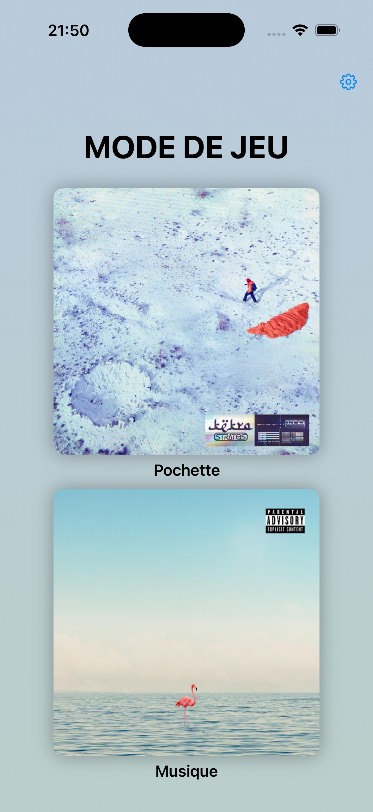
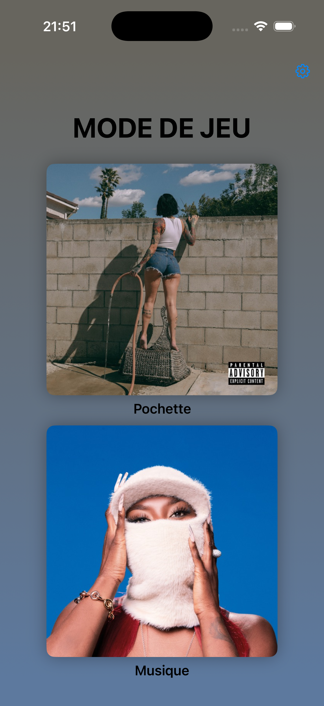
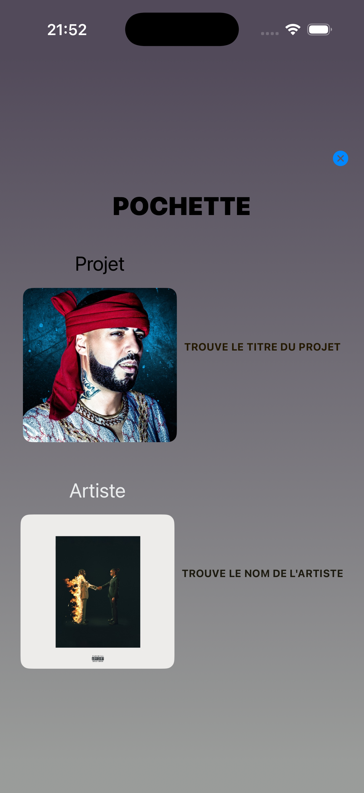
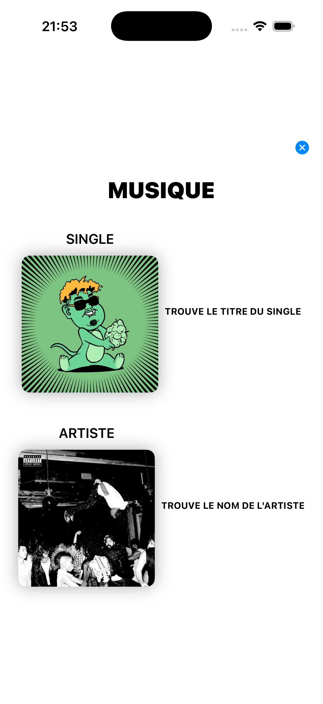
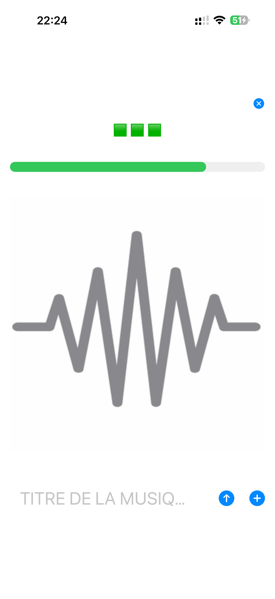
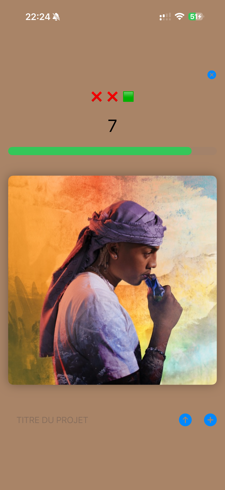

# MWS

MWS est un jeu iOS de quiz musical que j'ai fait en 2024. Le code arrive sur GitHub en 2026, ce qui explique l'écart entre les dates dans certains fichiers du projet et la date de publication du dépôt.

Le principe est simple : une pochette, un extrait, une réponse à trouver avant la fin du chrono. Le jeu tourne autour du rap francophone et anglophone, avec plusieurs niveaux et des réglages pour choisir la difficulté, la zone musicale et le nombre de tours.

## Ce qu'on fait dans le jeu

Il y a deux entrées principales depuis l'accueil. Le mode pochette demande de retrouver soit le titre d'un projet, soit le nom de l'artiste. Le mode musique lance un extrait audio et demande le titre du morceau.

Chaque manche garde une pression assez directe : trois essais, un timer, un champ de réponse, un bouton pour valider, et des petites aides quand le temps commence à manquer. Le jeu utilise aussi le retour haptique pour marquer les erreurs ou la fin du temps.

## Le fond vient des pochettes

Le détail visuel que je voulais vraiment garder, c'est le fond qui change avec les covers. Sur l'accueil, deux pochettes sont tirées au hasard, puis l'app récupère leur couleur moyenne pour construire un dégradé. Ça donne un écran qui ne reste jamais exactement pareil.





Dans les menus de jeu, le même principe sert aussi à accorder les textes et les fonds avec les images affichées. Certaines pochettes donnent un rendu froid, d'autres tirent vers des couleurs plus chaudes ou plus sombres.





En partie, l'idée reste lisible : la cover ou le symbole audio prend la place principale, le chrono reste visible, et l'interface garde juste ce qu'il faut pour répondre vite.





## Technique

Le projet est une app SwiftUI avec SwiftData pour stocker les réglages. Les écrans principaux sont dans `MWS/`, avec `ContentView` pour l'accueil, `Vue_pochette` et `Vue_musique` pour les modes, puis les vues de manche comme `Titre_projet`, `Artiste_projet` et `Titre_musique`.

Les données du jeu sont encore dans `Variables.swift`. C'est volontairement très direct : des tableaux par difficulté et par zone, reliés aux assets de pochettes et aux fichiers audio du bundle. La couleur moyenne des images passe par `UIImage+Extension.swift`, et les palettes plus détaillées utilisent ColorKit.

## Lancer le projet

Ouvrir `MWS.xcodeproj` dans Xcode, puis lancer la cible `MWS` sur un simulateur iPhone. Le projet vise iOS 17.

Le dossier local `Musique/`, qui contenait les MP3 utilisés pendant le prototype, n'est pas inclus dans ce dépôt public. Il était lourd et surtout pas adapté à une publication GitHub ouverte. Pour tester le mode musique avec ses propres sons, il faut ajouter des fichiers `.mp3` dans le bundle Xcode et garder les noms alignés avec les entrées de `Variables.swift`.

En ligne de commande :

```bash
xcodebuild -project MWS.xcodeproj -scheme MWS -sdk iphonesimulator build
```

Les extraits audio et les pochettes sont la matière de test du prototype. Avant une diffusion publique ou commerciale, il faut remplacer ces assets par des contenus autorisés ou vérifier les droits.
